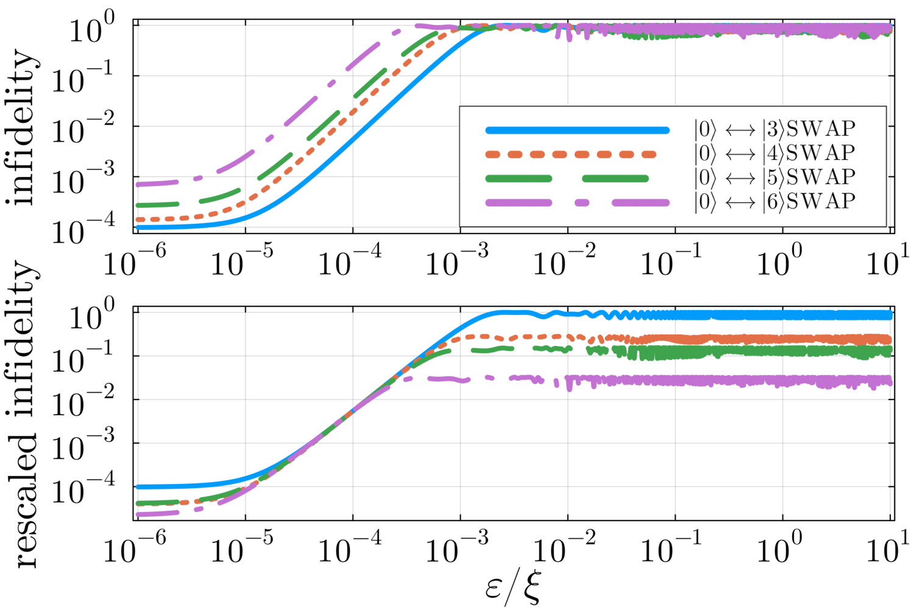

# [Dynamics of qudit gates and effects of spectator modes on optimal control pulses](https://arxiv.org/abs/2207.14006)

This referee report covers the preprint's discussion on cross-Kerr contributions to single-gate fidelity in qudit (multi-dimensional qubit) systems. 

## Outline

- Introduction to the qudit Hamiltonian with Kerr-anharmonicity.
- Methods for analyzing crosstalk effects on single-qudit gates, determined analytically and numerically via Juqbox.jl.
- Results on gate fidelity, scaling, and central figures.
- Conclusion, with suggestions for small clarifications and extensions.

Discussion of citations is limited.

## Intro and cQED Hamiltonian

The paper sets the context of circuit quantum electrodynamics (cQED), where superconducting oscillators are driven to perform qudit gates. The effective Hamiltonian is derived in a rotating frame, where the large linear harmonic contribution $\hbar\omega n$ is removed, leaving only the Kerr anharmonic corrections. These Kerr terms arise from Josephson-junction nonlinearities and are written as self-Kerr contributions, and include self-Kerr and cross-Kerr contributions

$$
\begin{equation}
H = \underbrace{-\frac{1}{2} \sum_i \xi_i (\hat{n}_i^2 - \hat{n}_i)}
    _{\text{self-Kerr component}}
    \underbrace{-\sum_{j>i}\xi_{ij} \hat{n}_i \hat{n}_j.}
    _{\text{cross-Kerr component}}
\end{equation}
$$

To evaluate this Hamiltonian's effects on single-qudit gate fidelity, the authors assume that spectators (oscillators that the gate does not interact with) are fixed in Fock states $|n_j\rangle$, in which case their self-Kerr terms reduce to constants (global phases). The active qudit’s Kerr terms remain operators and determine its dynamics. The effective Hamiltonian $H_{\text{eff}}$ thus captures both the self-Kerr of the active qudit and cross-Kerr induced shifts from populated spectators

$$
\begin{equation}
H_{\text{eff}} = 
    -\frac{\xi}{2} (\hat{n}^2 - \hat{n})
    -\sum_{j}\xi_{j} n_j \hat n.
\end{equation}
$$

## Analytical and Simulated Gate Fidelity

In an isolated qudit, single qudit gates can be made by driving the hamiltonian through some optimal pulse, resulting in the combined Hamiltonian $H(t) = H_0 + H_d(t)$. To connect the Hamiltonian to gate performance, the authors define gate fidelity through the overlap between the crosstalk-free gate implementation $U_0(t)$ and the same hamiltonian with cross-Kerr anharmonicity included $U_{\text{eff}}$, so the same drive Hamiltonian $H_d(t)$ is applied in both cases. 

Fidelity is proportional to the trace of the overlap $U_{\text{log}} \equiv U_0^\dagger(t) U_{\text{eff}}(t)$ squared. In simplifying this definition, global phases and constant spectator contributions are dropped, as they do not affect relative phases or populations within the non-spectator qudit. An analytical expression (Eq. 13) shows infidelity is quadratic with cross-Kerr terms, although the parameter on infidelity, which depends on the variance of the time average of the cross-Kerr term and is not discussed.

Optimal control pulses are parameterized by B-splines within Juqbox.jl, which adjusts coefficients of quadrature terms $(a + a^\dagger)$ and $(a - a^\dagger)$ to maximize fidelity. Simulations demonstrate that spectator-induced frequency detuning leads to gate errors scaling quadratically with $\epsilon/\xi$, where $\epsilon$ represents the cross-Kerr shift and $\xi$ the qudit’s anharmonicity. The numerical quadratic scaling matches the analytical equation and is the author's central result: gate errors remain negligible for small detunings but grow rapidly once spectators are significantly populated. Figure 1 in the paper illustrate this scaling for pauli-$X$-like $\text{SWAP}$ gates, copied below.

The lower plot is resecaled around $\epsilon/\xi=0.001$ to show matching slope $m=2$ on the log-log plot, which becomes quadratic on a linear plot. High $\epsilon/\xi$ represents highly-populated spectator states, while $\epsilon/\xi \rightarrow 0$ match the crosstalk-free single qudit result. This shows a match with the quadratic term appearing in the analytical fidelity result.

## Conclusion

Overall, I would publish this paper with minor revisions. The short paper clearly establishes the quadratic order of magnitude of infidelity due to crosstalk between qudits according to the system Hamiltonian. The only major addition that does not alter the scope of the paper is the discussion of infidelity mitigation, which is completely excluded. Mentioning dynamic decoupling, etc. does work to leave the door open, but leaving this and discussion of the variance of cross-Kerr in fidelity out leaves a problem hanging with solutions unattempted. Can a solution be as simple as compensating in the drive Hamiltonian $H_d(t)$? 

### Pedantics

$H_{eff} \rightarrow H_{\text{eff}}$ (use text mode). Same with $H_{\text{tot}}$ and $\omega/2\pi = 4.8$ GHz $\rightarrow \omega/2\pi = 4.8\text{GHz}$

The central figure of the paper, which plots infidelity versus $\epsilon / \xi$, shows the formula for frequency shift $\epsilon$ comes from the cross-Kerr component $\epsilon \hat V$. Writing out $\epsilon / \xi = \dots$ is minor, but instantly clarifies what is being plotted.