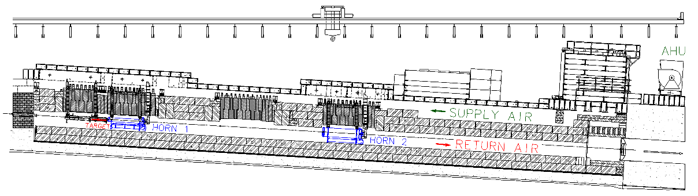
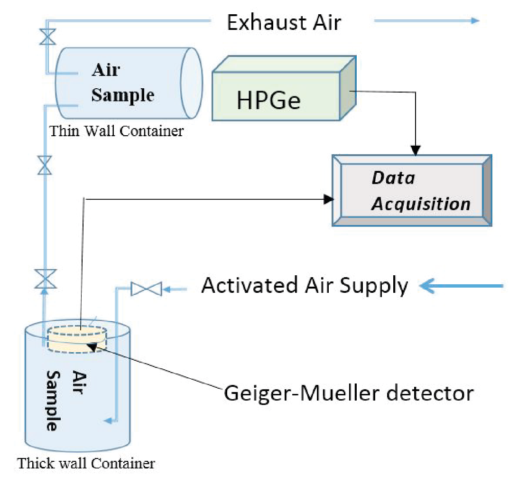

# [Measurements and calculations of air activation in the NuMI neutrino production facility at Fermilab with the 120‑GeV proton beam on target](https://arxiv.org/abs/1712.00068)
# Andrew Koren

Overview (one-line outline): The paper benchmarks air activation calculations with measurements at Fermilab’s NuMI beamline, using the updated MARS15 Monte Carlo code, and shows good agreement for key radionuclides ($^{11}\mathrm{C}$, $^{13}\mathrm{N}$, $^{15}\mathrm{O}$, $^{41}\mathrm{Ar}$) produced by 120‑GeV protons on target.

---

## Outline

Introduction:
- High‑power, high‑energy accelerators (e.g., NuMI, LBNF) raise radiation safety concerns due to release of $^{41}\mathrm{Ar}$ (110 min half‑life) and other radioactive gasses.
- Predicting radioactive gasses before site operation can be done via calculation and comparison to similar existing facilities.
- This work uses the NuMI target chase at Fermilab (120 GeV, megawatt beam power) to validate the MARS15 Monte Carlo code’s air activation model calcultations

Experimental Setup and Measurements:
- Air is recirculated in the target chase (space in the target pile surrounding the horns/targets), with radionucleides modeled by a differential equation that has an effective leak term $\lambda_L$ to account for air leaving the system.  

- The basic differential equation has an analytic solution, with parameters set by standard methodology employed at Fermilab.  
    - some values are determined via MARS simulation
    - warm-up during constant radation and cool-down after radation are different cases of the same decay formula
    - circulation period = volume / circulation rate
- Key parameters: beam pulse $8.6\ \mu\mathrm{s}$, cycle 1.75 s; air circulation period 42.96 s (6.97 s in active region); leak rate 1.24% per cycle; total air volume $5.07\times10^8\ \mathrm{cm}^3$. Irradiation: 14 h at 308 kW followed by 3.75 h at 243 kW.
- Two independent measurement techniques:  
  - HPGe detector for gamma‑ray spectroscopy (identifies $^{41}\mathrm{Ar}$ via 1293.64 keV peak; positron emitters via 511 keV peak).  
  - GM counter inside a thick‑walled container to record decay curves over ~140 min, allowing isotope decomposition by fitting.  

MARS15 Physics Model Updates and Calculations: 
- Initial MARS15 calculations showed a significant mismatch in the $^{11}C/^{13}N$ production ratio compared to experimental data, prompting a model update using CERN’s air activation approach.
- The update introduced refined $^{41}Ar$ cross-sections by analyzing experimental data across a broad energy range (10 MeV to 10 TeV for protons/neutrons/pions, as low as thermal neutrons)
    - This update improved the $^{41}Ar$ production rate prediction in the NuMI target chase by 15% alone.
- A new event generator was implemented for 1-200 MeV projectiles using the TENDL library
- Nuclide production is modeled using two methods: 
    - fully analog exclusive simulations, generated with various algorithms depending on energy
    - hadron fluence folding with pre-calculated cross-sections
- The details of the target chase were implemented in MARS, including air composition.

Comparison between Measurements and Calculations:
- Measured production rate densities ($\text{cm}^{-3} \text{POT}^{-1} \text{s}^{-1}$):  
  - $^{41}\mathrm{Ar}$: $1.98\times10^{-12}$,
  - $^{11}\mathrm{C}$: $6.38\times10^{-11}$, 
  - $^{13}\mathrm{N}$: $4.07\times10^{-11}$,
  - $^{15}\mathrm{O}$: $3.50\times10^{-11}$.  
- MARS15 predictions:  
  - $^{41}\mathrm{Ar}$: $1.08\times10^{-12}$ (ratio 0.55),
  - $^{11}\mathrm{C}$: $4.44\times10^{-11}$ (0.70),
  - $^{13}\mathrm{N}$: $3.71\times10^{-11}$ (0.91),
  - $^{15}\mathrm{O}$: $4.16\times10^{-11}$ (1.19).
- Agreement is within 30% for the positron emitters and within a factor of two for $^{41}\mathrm{Ar}$, which is considered acceptable given the typical safety factor of 2–3 applied to such predictions.  
- Measurement and calculation uncertainties are estimated at 12% and 15% (one standard deviation), respectively.
---

## Introduction

The release of radioactive gases from high‑power, high‑energy accelerators is a major radiation safety concern. In particular, $^{41}\mathrm{Ar}$ (half‑life 110 min) can contribute significantly to off‑site doses. Neutrino facilities such as the planned LBNF/DUNE and the operational NuMI/NOvA use 120‑GeV proton beams at the megawatt scale, making air activation predictions necessary.

Because direct measurements are not available before construction, calculations must be benchmarked against data from similar existing facilities. This work uses the NuMI beamline at Fermilab's many years of data to validate the MARS15 Monte Carlo code’s predictions of radionuclide production in air. The study focuses on the target chase, where the beam interacts with the target and focusing horns. 

MARS15 allows for modeling particle and heavy ion interaction across energy scales in arbitrary 3d regions, and it has been improved specifically for the purposes of this study. 

---

## Experimental Setup and Measurements

### 2.1 Experimental Setup and Air Circulation Model

The NuMI target chase (Fig. 1) contains a 120‑cm carbon target and two magnetic focusing horns, all surrounded by shielding. Air is recirculated by an air‑handling unit (AHU) approximately 50 m downstream of the target. The air mixing model is written as a simple differential equation, with each activated nucleus has the same probability of being removed from the region regardless of its production point. The master equation for the number $N_i$ of radionuclide $i$ is  

$$
\frac{dN_i}{dt} = P_i \dot{v}_p - (\lambda_i + \lambda_L) N_i,
$$

where $P_i$ is the production per proton, $\dot{v}_p$ the proton rate, $\lambda_i$ the decay constant, and $\lambda_L$ accounts for air leakage. The radionucleids can deacy/leak anywhere in the system, but are only produced in proton irradiated region. The setup for measuring radionucleides is illustrated in Fig. 2.

Figure 1: A diagram of the NuMI target pile. The target chase is the volume from which air samples were taken. The AHU recirculates air; the distance between the upstream end of the target and the AHU is about 50 m.

Figure 2: Sampling and measuring configuration. Valves allow the air to circulate through the containers; after reaching equilibrium they are closed to measure decay rates “in situ” with a High Purity Ge detector (HPGe) and a Geiger‑Mueller (GM) counter.

### 2.2 Analytical Description of Radionuclide Build‑up and Cool‑down

Equations (2)–(9) in the paper provide a formalism to handle the complex irradiation history (two consecutive periods of different beam power, periodic beam structure, and air recirculation). The key parameters are:  
- Beam pulse length $\tau_p = 8.6\times10^{-6}$ s, cycle time $\tau_b = 1.75$ s.  
- Air circulation period $\tau_c = 42.96$ s, of which $\tau_a = 6.97$ s is spent in the target/horn region.  
- Leak rate $1.24\%$ per circulation cycle.  
- Total air volume $5.07\times10^8$ cm³, circulation rate $1.18\times10^7$ cm³/s.

The analysis uses these parameters together with the irradiation periods (14 h at 308 kW followed by 3.75 h at 243 kW) to compute the expected radionuclide concentrations.

### 2.3 Data and Analysis

Two independent measurements were performed. A HPGe detector was filled with activated air, and gamma‑rays were counted. $^{41}\mathrm{Ar}$ was identified by its 1293.64 keV peak, while positron emitters ($^{11}\mathrm{C}$, $^{13}\mathrm{N}$, $^{15}\mathrm{O}$) were observed via the 511 keV annihilation peak. Absolute activity was derived after correcting for geometry, decay, and detector efficiency.
A Geiger-Müller counter recorded decay counts over ~140 minutes, with the compound decay curve fitted to extract the contributions of different isotopes.

---

## MARS15 Physics Model Updates and Calculations

### 3.1 Predictive Features and Challenges

Predictions for nuclide production are inherently less certain than other radiation quantities, with agreement within 30-50% considered very good due to complexities in modeling phenomena like air activation across a wide energy range. Aside from the physics, physical geometry and dynamic air flow are difficult to model in common codes.

### 3.2 Radionuclide Production on Light Target Nuclei

An initial discrepancy in the $^{11}\mathrm{C}/^{13}\mathrm{N}$ ratio motivated an update using the approach developed for LHC air activation studies. Production cross sections for incident protons, neutrons, and pions from 10 MeV to 10 TeV, and for neutrons down to thermal energies, were revised using experimental data and systematics. Figure 4 shows the improved $^{13}\mathrm{N}$ production cross section on oxygen.

<!-- <figure>
  
  <figcaption>Figure 4: Production cross section of $^{13}\mathrm{N}$ on oxygen nuclei for incident protons. The improved model (histogram) matches available experimental data.</figcaption>
</figure> -->

### 3.3 Event Generator Improvement for 1–200 MeV Projectiles

Low‑energy neutron fluxes (important for $^{41}\mathrm{Ar}$ production) were previously underestimated. A new inclusive/exclusive event generator based on the TENDL‑2015 library was implemented for projectiles below 200 MeV (protons, neutrons, deuterons, tritons, $^3\mathrm{He}$, $^4\mathrm{He}$, and gammas). This improved the predicted $^{41}\mathrm{Ar}$ production by about 15% and gave excellent agreement with measured neutron production (Figs. 5–7).

### 3.4 Nuclide Production Modeling

To improve modeling accuracy for intermediate-energy projectiles, a new event generator was implemented in MARS15 using the TENDL library for incident particles in the 1–200 MeV range. A fully analog exclusive simulation selects event generators based on projectile energy. Additionally, a hadron-fluence folding Monte-Carlo method uses pre-calculated, energy-dependent cross-sections.  

The second method was chosen for these calculations because it is less CPU‑intensive while giving similar results for the important nuclides.

### 3.5 Simulation Sequence

A detailed geometry of the NuMI target chase was implemented in MARS15 with air composition from Table 1. Energy cutoffs were 100 keV for charged hadrons and $10^{-9}$ eV for neutrons, and MCNP mode was used for low‑energy neutron transport.

---

## Comparison between Measurements and Calculations

Table 2 shows the measured and calculated production rate densities (cm⁻³ POT⁻¹ s⁻¹) for the four key radionuclides.

| Radionuclide | $^{41}\mathrm{Ar}$ | $^{11}\mathrm{C}$ | $^{13}\mathrm{N}$ | $^{15}\mathrm{O}$ |
|--------------|----------------------|-------------------|-------------------|-------------------|
| Measurement  | $1.98\times10^{-12}$ | $6.38\times10^{-11}$ | $4.07\times10^{-11}$ | $3.50\times10^{-11}$ |
| MARS15       | $1.08\times10^{-12}$ | $4.44\times10^{-11}$ | $3.71\times10^{-11}$ | $4.16\times10^{-11}$ |
| Ratio (MARS/Meas) | 0.55 | 0.70 | 0.91 | 1.19 |

The MARS15 prediction for $^{41}\mathrm{Ar}$ is 1.8 times lower than the measurement. Given the typical safety factor of 2–3 applied to code predictions, this is considered acceptable. For $^{11}\mathrm{C}$ and $^{13}\mathrm{N}$ the agreement is within 30%, and for $^{15}\mathrm{O}$ the agreement is excellent (within 20%). The uncertainties are estimated at 12% (measurement) and 15% (calculation).

---

## Conclusions

The updated MARS15 code, incorporating improved cross sections for light nuclei and the TENDL‑based event generator for low‑energy projectiles, yields good agreement with measured air activation rates at the NuMI facility. The $^{41}\mathrm{Ar}$ production is underestimated by a factor of 1.8, which is acceptable when safety margins are applied. The benchmarking provides confidence in using MARS15 for predicting air activation at future high‑power neutrino facilities such as LBNF/DUNE.

---

## Referee

This paper presents a benchmark of air activation calculations against measurements at Fermilab’s NuMI beamline. The authors have updated the MARS15 Monte Carlo code with refined cross sections for light nuclei and a TENDL‑based low‑energy event generator, then compared simulated production rates of $^{41}\mathrm{Ar}$, $^{11}\mathrm{C}$, $^{13}\mathrm{N}$, and $^{15}\mathrm{O}$ with experimental data. The agreement is within 30% for the positron emitters and within a factor of two for $^{41}\mathrm{Ar}$. Design of new facilities like LBNF/DUNE use a ~3x safety margin anyways, so this is well within necessary accuracy for facility design. 

### Recommendation

The paper is well written, the methodology is sound, and the results are valuable. I recommend acceptance as is.

---